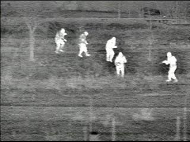

# Image Processing Application

This is an image processing application that allows the user to perform various image manipulation tasks such as detecting edges, highlighting people, and saving images. The application is built in C++ using the OpenCV library, and it includes a command-line interface for easy interaction.

## Features

1. **Load Image**  
   Load an image from a specified directory and display it for further processing.
   
2. **Save Image**  
   Save the processed image to a desired location.

3. **Edge Detection**  
   Detect edges using Canny edge detection, with additional image enhancements.

4. **Highlight People**  
   Detect people in the image using watershed segmentation and display bounding boxes around the detected people.

5. **Edge Detection and People Highlighting**  
   Perform both edge detection and highlight people in a single operation.

## Prerequisites

- C++ Compiler (e.g., GCC, MSVC)
- OpenCV 4.x or higher
- Windows OS (for directory browsing via WinAPI)

## How to Build

1. Make sure you have OpenCV installed on your system.
2. Create a new C++ project and link it with OpenCV libraries.
3. Copy the provided code into your project.
4. Compile and run the program.

## Running the Program

After running the program, you will be presented with a menu. You can choose different options:

1. **Load Image**: Select an image from the folder to be processed.
2. **Save Image**: Save the processed image to your chosen location.
3. **Detect Edges**: Apply Canny edge detection on the image.
4. **Highlight People**: Detect people using watershed segmentation and draw bounding boxes around them.
5. **Detect Edges and Highlight People**: Apply both edge detection and people highlighting simultaneously.

The program allows you to navigate through a directory of images and choose the file you want to work with. After processing the image, you can save the result.

## Example of Usage

### Loading an Image
When you select the "Load Image" option, you will be prompted to enter the directory path. The program will display a list of images from the directory. After choosing one, the image will be loaded and processed.

### Processing the Image
You can then apply edge detection or highlight people in the image using the respective options. After processing, you can save the result.

### Example Results

#### Original Image
Here is an example of an original image that can be loaded from the `images` directory:

#### Edges Detected
After applying edge detection, the result looks like this:

#### People Highlighted
Once the program detects people, it draws bounding boxes around them:

## Directory Structure
